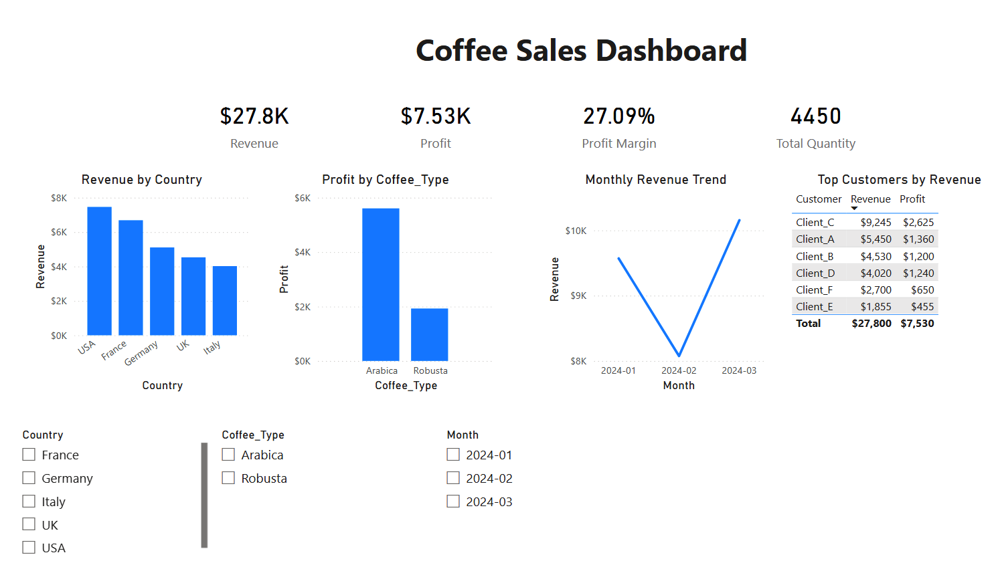

{\rtf1\ansi\ansicpg1252\cocoartf2709
\cocoatextscaling0\cocoaplatform0{\fonttbl\f0\fswiss\fcharset0 Helvetica;}
{\colortbl;\red255\green255\blue255;}
{\*\expandedcolortbl;;}
\paperw11900\paperh16840\margl1440\margr1440\vieww11520\viewh8400\viewkind0
\pard\tx720\tx1440\tx2160\tx2880\tx3600\tx4320\tx5040\tx5760\tx6480\tx7200\tx7920\tx8640\pardirnatural\partightenfactor0

\f0\fs24 \cf0 # Coffee Sales Dashboard (Power BI)\
\
## Overview\
This project analyses coffee sales data using Power BI. It focuses on revenue, profit, customer performance, and monthly business trends.\
\
## Dashboard Features\
- KPI cards for Revenue, Profit, Profit Margin, and Quantity\
- Revenue analysis by country\
- Profit comparison by coffee type\
- Monthly revenue trend analysis\
- Top customers by revenue\
- Interactive filters (Country, Coffee Type, Month)\
\
## Tools Used\
- Power BI\
- Excel\
\
## Dashboard Preview\
\
\
## How to Use\
1. Download the `.pbix` file\
2. Open in Power BI Desktop\
3. Interact with filters to explore insights\
\
## Key Insights\
- USA generates the highest revenue\
- Arabica coffee is significantly more profitable than Robusta\
- Revenue fluctuates monthly, with a dip in February}